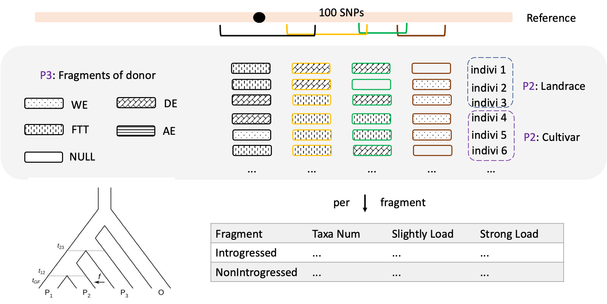
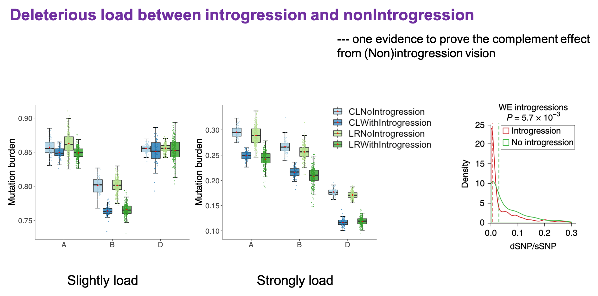
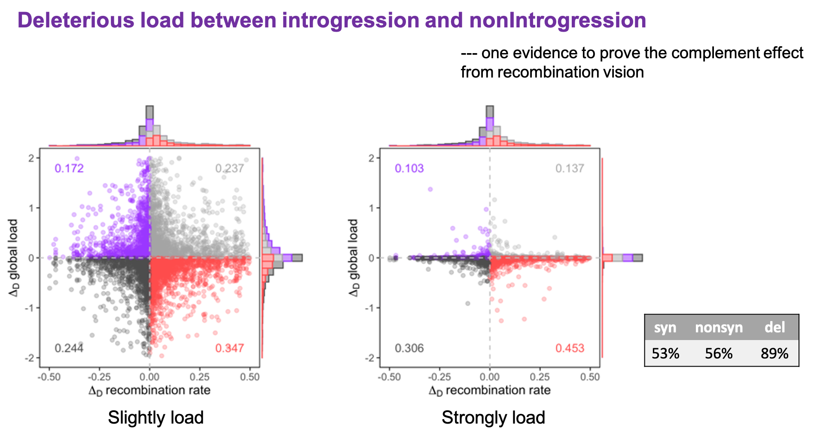

```{r echo=F, message=FALSE, warning=FALSE}
knitr::opts_chunk$set(eval = T,echo = F,include = T, warning = F,message = F)
# eval 代码要不要执行
# echo 代码要不要输出
# include 图要不要输出
# warning 警告要不要输出
# message 默认信息要不要输出(如bins=30)
library(tidyverse)
library(lvplot)
library(RColorBrewer)
library(ggpubr)
library(viridisLite)
library(viridis)
library(formattable)

```

# Schematic illustration of Individual-by-individual introgression

**Scientific question:** To what extent could the different donor
mitigate the deleterious load?

**Conclusion:**

-   Expectation: Nonsynonymous load \< synonymous load

-   Expectation: deleterious mutation num \<\< synonymous mutation num

-   *Ae. tauschii* provide much more adaptive introgression alleles

    -   Introgression can reduce slightly load on AB subgenome
    -   Introgression can reduce strongly load specially on D subgenome

-   Load is not enriched on individual chromosomes

-   Slightly load is mainly concentrated on the low recombination area



# Data import and mutate

```{r}
table <- read.table("fdLoadBySubspecies100SNPwindow_50Step.txt.gz", header = T, sep = "\t")
table <- table %>% mutate(Sub=substring(Chr, 2,2))
table$P2 <- factor(table$P2, levels = c("Landrace", "Cultivar"), labels = c("LR","CL"), ordered = T)
# unique(table$P3)
table$P3 <- factor(table$P3, levels = c("Wild_emmer","Domesticated_emmer","Free_threshing_tetraploid","Ae"),labels = c("WE","DE","FT","AT"), ordered = T)
table$Sub <- factor(table$Sub, levels = c("A","B","D"), ordered = T)
table <- mutate(table,SubID = substr(Chr, 1, 1))
table$IntrogressedWeaklyLoad <- (table$IntrogressedNonTotalCount + table$IntrogressedDelTotalCount)/table$IntrogressedSynTotalCount
table$IntrogressedStronglyLoad <- (table$IntrogressedDelTotalCount)/table$IntrogressedSynTotalCount
table$NonIntrogressedWeaklyLoad <- (table$NonIntrogressedNonTotalCount + table$NonIntrogressedDelTotalCount)/ table$NonIntrogressedSynTotalCount
table$NonIntrogressedStronglyLoad <- (table$NonIntrogressedDelTotalCount)/table$NonIntrogressedSynTotalCount
table$WeaklyLoad <- table$IntrogressedWeaklyLoad / table$NonIntrogressedWeaklyLoad
table$StronglyLoad <- table$IntrogressedStronglyLoad / table$NonIntrogressedStronglyLoad
```

# popFd distribution

## Histogram

```{r}
# 查看popFd和load的分布
df <- table %>% filter(PopulationFd!="NA")
# popFd的分布 直方图
ggplot(df, aes(x=PopulationFd, fill=Sub, color=Sub))+
  geom_histogram(position = "dodge", alpha=0.4,bins = 30)+
  # geom_density(alpha=0.6)+
  facet_grid(P2~P3)+
  labs(x=expression(italic(f)["d"]))+
  scale_fill_brewer(palette = "Set2")+
  scale_color_brewer(palette = "Set2")+
  scale_x_continuous(breaks = seq(0,1,by = 0.5), limits = c(0.00001,1))+
  theme_classic()+
  theme(legend.position = "none", legend.title = element_blank(),
        panel.background = element_rect(fill="transparent"),
        # legend.text = element_text(size = 10),
        # legend.key.size = unit(1,"cm"),
        legend.background = element_rect(fill="transparent"),
        strip.background = element_blank(),
        axis.title.x = element_blank(),
        axis.line = element_blank(),
        text = element_text(size = 14),
        panel.border = element_rect(colour = "black",fill = "transparent"))
```

## Boxplot

```{r}
# popFd的分布 boxplot
colBySubspeciesP3<- c("#ffd702","#7f5701","#016699","#87cef9")
q <- ggplot(df, aes(x=Sub, y=PopulationFd, fill=P3))+
  geom_boxplot(position = position_dodge(0.8), alpha=0.8)+
  stat_boxplot(geom = "errorbar", linetype=1, width=0.2, position = position_dodge(0.8))+
  # geom_lv(width.method = "height", position = position_dodge(0.8))+
  stat_summary(geom = "point",fun = mean,size=1, position = position_dodge(0.8), color="red", alpha=0.8)+
  # geom_histogram(position = "identity", alpha=0.6,bins = 30,color="transparent")+
  # geom_density(alpha=0.6)+
  facet_grid(P2~.)+
  labs(y=expression(italic(f)["d"]))+
  scale_fill_manual(values = colBySubspeciesP3)+
  theme_classic()+
  theme(legend.position = "none", legend.title = element_blank(),
        panel.background = element_rect(fill="transparent"),
        # legend.text = element_text(size = 10),
        # legend.key.size = unit(1,"cm"),
        legend.background = element_rect(fill="transparent"),
        strip.background = element_blank(),
        axis.title.x = element_blank(),
        axis.line = element_blank(),
        text = element_text(size = 14),
        panel.border = element_rect(colour = "black",fill = "transparent"))
q
```

The results of population *f*<sub>d show that free-thresh tetraploid
donor contributes the most fragments compared with wild emmer,
domesticated emmer.

# Weakly load

-   Introgressed Weakly load distribution
-   NonIntrogressed Weakly load distribution

## Introgressed Weakly load distribution

```{r}
introgressedWeaklyLoadDf <- table %>% 
  filter(!is.na(IntrogressedWeaklyLoad)) %>% 
  filter(!is.nan(IntrogressedWeaklyLoad)) 

## inf -> max
# max(introgressedWeaklyLoadDf$IntrogressedWeaklyLoad, na.rm = T)
# min(introgressedWeaklyLoadDf$IntrogressedWeaklyLoad, na.rm = T)

maxIntrogressedWeaklyLoadDf <- introgressedWeaklyLoadDf %>% 
  filter(!is.na(IntrogressedWeaklyLoad)) %>% 
  filter(!is.nan(IntrogressedWeaklyLoad)) %>% 
  filter(is.finite(IntrogressedWeaklyLoad)) %>% 
  arrange(desc(IntrogressedWeaklyLoad))
maxIntrogressedWeaklyLoad <- maxIntrogressedWeaklyLoadDf$IntrogressedWeaklyLoad[1]
# maxIntrogressedWeaklyLoad

introgressedWeaklyLoadDf$IntrogressedWeaklyLoad <- ifelse(is.infinite(introgressedWeaklyLoadDf$IntrogressedWeaklyLoad), maxIntrogressedWeaklyLoad, introgressedWeaklyLoadDf$IntrogressedWeaklyLoad)


ggplot(introgressedWeaklyLoadDf, aes(x=IntrogressedWeaklyLoad, fill=Sub, color=Sub))+
  geom_histogram(position = "dodge", alpha=0.4)+
  # geom_density(alpha=0.6, adjust=1)+
  facet_grid(P2~P3)+
  labs(x=expression("IntrogressedWeaklyLoad"))+
  scale_fill_brewer(palette = "Set2")+
  scale_color_brewer(palette = "Set2")+
  # scale_x_continuous(breaks = seq(0,2,by = 0.5))+
  # coord_cartesian(xlim = c(0,1.0))+
  theme_minimal()+
  theme(legend.title=element_blank(), legend.position = c(0.9,0.9))

## scale_x_log10()
ggplot(introgressedWeaklyLoadDf, aes(x=IntrogressedWeaklyLoad+0.001, fill=Sub, color=Sub))+
  geom_histogram(position = "dodge", alpha=0.4)+
  # geom_density(alpha=0.6, adjust=1)+
  facet_grid(P2~P3)+
  labs(x=expression("IntrogressedWeaklyLoad"))+
  scale_fill_brewer(palette = "Set2")+
  scale_color_brewer(palette = "Set2")+
  scale_x_log10(breaks = scales::trans_breaks("log10", function(x) 10^x),
                labels = scales::trans_format("log10", scales::math_format(10^.x)))+
  # coord_cartesian(xlim = c(0,1.0))+
  theme_minimal()+
  theme(legend.title=element_blank(), legend.position = c(0.9,0.9))
```

## NonIntrogressed Weakly load distribution

```{r}
NonintrogressedWeaklyLoadDf <- table %>% 
  filter(!is.na(table$ NonIntrogressedWeaklyLoad)) %>% 
  filter(!is.nan(NonIntrogressedWeaklyLoad)) 

## inf -> max
# max(NonintrogressedWeaklyLoadDf$NonIntrogressedWeaklyLoad, na.rm = T)
# min(NonintrogressedWeaklyLoadDf$NonIntrogressedWeaklyLoad, na.rm = T)

maxNonIntrogressedWeaklyLoadDf <- NonintrogressedWeaklyLoadDf %>% 
  filter(!is.na(NonIntrogressedWeaklyLoad)) %>% 
  filter(!is.nan(NonIntrogressedWeaklyLoad)) %>% 
  filter(is.finite(NonIntrogressedWeaklyLoad)) %>% 
  arrange(desc(NonIntrogressedWeaklyLoad))
maxNonIntrogressedWeaklyLoad <- maxNonIntrogressedWeaklyLoadDf$NonIntrogressedWeaklyLoad[1]
# maxNonIntrogressedWeaklyLoad

NonintrogressedWeaklyLoadDf$NonIntrogressedWeaklyLoad <- ifelse(is.infinite(NonintrogressedWeaklyLoadDf$NonIntrogressedWeaklyLoad), maxNonIntrogressedWeaklyLoad, NonintrogressedWeaklyLoadDf$NonIntrogressedWeaklyLoad)


ggplot(NonintrogressedWeaklyLoadDf, aes(x=NonIntrogressedWeaklyLoad, fill=Sub, color=Sub))+
  geom_histogram(position = "dodge", alpha=0.4)+
  # geom_density(alpha=0.6, adjust=1)+
  facet_grid(P2~P3)+
  labs(x=expression("NonIntrogressedWeaklyLoad"))+
  scale_fill_brewer(palette = "Set2")+
  scale_color_brewer(palette = "Set2")+
  # scale_x_continuous(breaks = seq(0,2,by = 0.5))+
  # coord_cartesian(xlim = c(0,1.0))+
  theme_minimal()+
  theme(legend.title=element_blank(), legend.position = c(0.9,0.9))

## scale_x_log10()
ggplot(NonintrogressedWeaklyLoadDf, aes(x=NonIntrogressedWeaklyLoad+0.001, fill=Sub, color=Sub))+
  geom_histogram(position = "dodge", alpha=0.4)+
  # geom_density(alpha=0.6, adjust=1)+
  facet_grid(P2~P3)+
  labs(x=expression("NonIntrogressedWeaklyLoad"))+
  scale_fill_brewer(palette = "Set2")+
  scale_color_brewer(palette = "Set2")+
  scale_x_log10(breaks = scales::trans_breaks("log10", function(x) 10^x),
                labels = scales::trans_format("log10", scales::math_format(10^.x)))+
  # coord_cartesian(xlim = c(0,1.0))+
  theme_minimal()+
  theme(legend.title=element_blank(), legend.position = c(0.95,0.9))
```

# Strongly load

-   Introgressed strongly load distribution
-   NonIntrogressed strongly load distribution

## Introgressed strongly load distribution

```{r}

introgressedStronglyLoadDf <- table %>% 
  filter(!is.na(table$IntrogressedStronglyLoad)) %>% 
  filter(!is.nan(IntrogressedStronglyLoad)) 

## inf -> max
# max(introgressedStronglyLoadDf$IntrogressedStronglyLoad, na.rm = T)
# min(introgressedStronglyLoadDf$IntrogressedStronglyLoad, na.rm = T)

maxIntrogressedStronglyLoadDf <- introgressedStronglyLoadDf %>% 
  filter(!is.na(IntrogressedStronglyLoad)) %>% 
  filter(!is.nan(IntrogressedStronglyLoad)) %>% 
  filter(is.finite(IntrogressedStronglyLoad)) %>% 
  arrange(desc(IntrogressedStronglyLoad))
maxIntrogressedStronglyLoad <- maxIntrogressedStronglyLoadDf$IntrogressedStronglyLoad[1]
# maxIntrogressedStronglyLoad

introgressedStronglyLoadDf$IntrogressedStronglyLoad <- ifelse(is.infinite(introgressedStronglyLoadDf$IntrogressedStronglyLoad), maxIntrogressedStronglyLoad, introgressedStronglyLoadDf$IntrogressedStronglyLoad)


ggplot(introgressedStronglyLoadDf, aes(x=IntrogressedStronglyLoad, fill=Sub, color=Sub))+
  geom_histogram(position = "dodge", alpha=0.4)+
  # geom_density(alpha=0.6, adjust=1)+
  facet_grid(P2~P3)+
  labs(x=expression("IntrogressedStronglyLoad"))+
  scale_fill_brewer(palette = "Set2")+
  scale_color_brewer(palette = "Set2")+
  # scale_x_continuous(breaks = seq(0,2,by = 0.5))+
  # coord_cartesian(xlim = c(0,1.0))+
  theme_minimal()+
  theme(legend.title=element_blank(), legend.position = c(0.9,0.9))

## scale_x_log10()
ggplot(introgressedStronglyLoadDf, aes(x=IntrogressedStronglyLoad+0.001, fill=Sub, color=Sub))+
  geom_histogram(position = "dodge", alpha=0.4)+
  # geom_density(alpha=0.6, adjust=1)+
  facet_grid(P2~P3)+
  labs(x=expression("IntrogressedStronglyLoad"))+
  scale_fill_brewer(palette = "Set2")+
  scale_color_brewer(palette = "Set2")+
  scale_x_log10(breaks = scales::trans_breaks("log10", function(x) 10^x),
                labels = scales::trans_format("log10", scales::math_format(10^.x)))+
  # coord_cartesian(xlim = c(0,1.0))+
  theme_minimal()+
  theme(legend.title=element_blank(), legend.position = c(0.9,0.9))
```

## NonIntrogressed strongly load distribution

```{r}
NonintrogressedStronglyLoadDf <- table %>% 
  filter(!is.na(table$ NonIntrogressedStronglyLoad)) %>% 
  filter(!is.nan(NonIntrogressedStronglyLoad)) 

## inf -> max
# max(NonintrogressedStronglyLoadDf$NonIntrogressedStronglyLoad, na.rm = T)
# min(NonintrogressedStronglyLoadDf$NonIntrogressedStronglyLoad, na.rm = T)

maxNonIntrogressedStronglyLoadDf <- NonintrogressedStronglyLoadDf %>% 
  filter(!is.na(NonIntrogressedStronglyLoad)) %>% 
  filter(!is.nan(NonIntrogressedStronglyLoad)) %>% 
  filter(is.finite(NonIntrogressedStronglyLoad)) %>% 
  arrange(desc(NonIntrogressedStronglyLoad))
maxNonIntrogressedStronglyLoad <- maxNonIntrogressedStronglyLoadDf$NonIntrogressedStronglyLoad[1]
# maxNonIntrogressedStronglyLoad

NonintrogressedStronglyLoadDf$NonIntrogressedStronglyLoad <- ifelse(is.infinite(NonintrogressedStronglyLoadDf$NonIntrogressedStronglyLoad), maxNonIntrogressedStronglyLoad, NonintrogressedStronglyLoadDf$NonIntrogressedStronglyLoad)


ggplot(NonintrogressedStronglyLoadDf, aes(x=NonIntrogressedStronglyLoad, fill=Sub, color=Sub))+
  geom_histogram(position = "dodge", alpha=0.4)+
  # geom_density(alpha=0.6, adjust=1)+
  facet_grid(P2~P3)+
  labs(x=expression("NonIntrogressedStronglyLoad"))+
  scale_fill_brewer(palette = "Set2")+
  scale_color_brewer(palette = "Set2")+
  # scale_x_continuous(breaks = seq(0,2,by = 0.5))+
  # coord_cartesian(xlim = c(0,1.0))+
  theme_minimal()+
  theme(legend.title=element_blank(), legend.position = c(0.9,0.9))

## scale_x_log10()
ggplot(NonintrogressedStronglyLoadDf, aes(x=NonIntrogressedStronglyLoad+0.001, fill=Sub, color=Sub))+
  geom_histogram(position = "dodge", alpha=0.4)+
  # geom_density(alpha=0.6, adjust=1)+
  facet_grid(P2~P3)+
  labs(x=expression("NonIntrogressedStronglyLoad"))+
  scale_fill_brewer(palette = "Set2")+
  scale_color_brewer(palette = "Set2")+
  scale_x_log10(breaks = scales::trans_breaks("log10", function(x) 10^x),
                labels = scales::trans_format("log10", scales::math_format(10^.x)))+
  # coord_cartesian(xlim = c(0,1.0))+
  theme_minimal()+
  theme(legend.title=element_blank(), legend.position = c(0.9,0.9))

```

# Weakly load ratio (Introgressed/Nonintrogressed)

```{r}
WeaklyLoadDf <- table %>% 
  filter(!is.na(WeaklyLoad)) %>% 
  filter(!is.nan(WeaklyLoad)) 

## inf -> max
# max(WeaklyLoadDf$WeaklyLoad, na.rm = T)
# min(WeaklyLoadDf$WeaklyLoad, na.rm = T)

maxWeaklyLoadDf <- WeaklyLoadDf %>% 
  filter(!is.na(WeaklyLoad)) %>% 
  filter(!is.nan(WeaklyLoad)) %>% 
  filter(is.finite(WeaklyLoad)) %>% 
  arrange(desc(WeaklyLoad))

maxWeaklyLoad <- maxWeaklyLoadDf$WeaklyLoad[1]
# maxWeaklyLoad

WeaklyLoadDf$WeaklyLoad <- ifelse(is.infinite(WeaklyLoadDf$WeaklyLoad), maxWeaklyLoad, WeaklyLoadDf$WeaklyLoad)


ggplot(WeaklyLoadDf, aes(x=WeaklyLoad, fill=Sub, color=Sub))+
  geom_histogram(position = "dodge", alpha=0.4)+
  # geom_segment(aes(x=1,y = 0,xend=1, yend=6000),color="black",linetype=2, size=0.1, alpha=1)+
  geom_vline(xintercept=1,linetype=2, size=0.2)+
  # geom_density(alpha=0.6)+
  facet_grid(P2~P3)+
  labs(x=expression("Weakly load (Introgressed/NonIntrogressed)"))+
  scale_fill_brewer(palette = "Set2")+
  scale_color_brewer(palette = "Set2")+
  # scale_x_continuous(breaks = seq(0,2,by = 1))+
  # coord_cartesian(xlim = c(0,2))+
  theme_minimal()+
  theme(legend.title=element_blank(), legend.position = "none")
# theme(legend.position = c(0.75,0.35), legend.background = element_blank(),legend.title = element_blank(), 
#       panel.background = element_rect(fill = "transparent"),legend.title=element_blank(),
#       panel.grid = element_blank(), axis.line = element_line(size = 0.3))
# ggsave("2.pdf",width = 6, height = 4)

## scale_x_log10()
ggplot(WeaklyLoadDf, aes(x=WeaklyLoad + 0.0001, fill=Sub, color=Sub))+
  geom_histogram(position = "dodge", alpha=0.4)+
  # geom_density(alpha=0.6, adjust=1)+
  geom_vline(xintercept=1,linetype=2, size=0.2)+
  facet_grid(P2~P3)+
  labs(x=expression("Weakly load (Introgressed/NonIntrogressed)"))+
  scale_fill_brewer(palette = "Set2")+
  scale_color_brewer(palette = "Set2")+
  scale_x_log10(breaks = scales::trans_breaks("log10", function(x) 10^x),
                labels = scales::trans_format("log10", scales::math_format(10^.x)))+
  # coord_cartesian(xlim = c(0,1.0))+
  theme_minimal()+
  theme(legend.title=element_blank(), legend.position = 'none')

## boxplot
colBySubspeciesP3<- c("#ffd702","#7f5701","#016699","#87cef9")

q <- ggplot(WeaklyLoadDf, aes(x=Sub, y=WeaklyLoad + 0.0001, fill=P3))+
  # geom_boxplot()+
  # geom_lv(position = position_dodge(0.8),width.method = "height",color="black",conf=0.9,k=4)+
  # stat_summary(geom = "point",fun = median,size=2, color="black",
  #              position = position_dodge(0.8))+
  geom_hline(yintercept = 1, linetype=2, color="grey")+
  stat_summary(geom = "pointrange", fun.data = mean_cl_boot, aes(color=P3), 
               position = position_dodge(0.8))+
  facet_grid(P2~.)+
  labs(y=expression("The ratio of slightly load"))+
  # scale_fill_brewer(palette = "Set2")+
  # scale_color_brewer(palette = "Set2")+
  scale_fill_manual(values = colBySubspeciesP3)+
  scale_color_manual(values = colBySubspeciesP3)+
  scale_y_log10(breaks = scales::trans_breaks("log2", function(x) 2^x),
                labels = scales::trans_format("log2", scales::math_format(2^.x)))+
  # coord_cartesian(xlim = c(0,1.0))+
  theme_classic()+
  theme(legend.position = "none", legend.title = element_blank(),
        legend.background = element_rect(fill="transparent"),
        strip.background = element_blank(),
        axis.title.x = element_blank(),
        axis.line = element_blank(),
        text = element_text(size = 14),
        panel.border = element_rect(colour = "black",fill = "transparent"))
q
```

# Strongly load ratio (Introgressed/Nonintrogressed)

```{r}
StronglyLoadDf <- table %>% 
  filter(!is.na(StronglyLoad)) %>% 
  filter(!is.nan(StronglyLoad)) 

## inf -> max
# max(StronglyLoadDf$StronglyLoad, na.rm = T)
# min(StronglyLoadDf$StronglyLoad, na.rm = T)

maxStronglyLoadDf <- StronglyLoadDf %>% 
  filter(!is.na(StronglyLoad)) %>% 
  filter(!is.nan(StronglyLoad)) %>% 
  filter(is.finite(StronglyLoad)) %>% 
  arrange(desc(StronglyLoad))

maxStronglyLoad <- maxStronglyLoadDf$StronglyLoad[1]
# maxStronglyLoad

StronglyLoadDf$StronglyLoad <- ifelse(is.infinite(StronglyLoadDf$StronglyLoad), maxStronglyLoad, StronglyLoadDf$StronglyLoad)

# ### find = 0 Inf proportion
# StronglyLoadDf <- table %>% 
#   filter(!is.na(StronglyLoad)) %>% 
#   filter(!is.nan(StronglyLoad)) 
# nrow(StronglyLoadDf)
# InfStronglyLoadDf <- StronglyLoadDf %>% 
#   filter(is.infinite(StronglyLoad)) 
# nrow(InfStronglyLoadDf)
# ZeroStronglyLoadDf <- StronglyLoadDf %>% 
#   filter(StronglyLoad == 0) 
# nrow(ZeroStronglyLoadDf)
# MedianStronglyLoadDf <- StronglyLoadDf %>% 
#   filter(StronglyLoad > 0,is.finite(StronglyLoad)) 
# nrow(MedianStronglyLoadDf)
# 
# 13603 + 21380 + 31830
# 66813

# StronglyLoadDf <- table %>% 
#   filter(!is.na(StronglyLoad)) %>% 
#   filter(!is.nan(StronglyLoad)) 
# ProportionStronglyLoadDf <- StronglyLoadDf %>% 
#   mutate(Proportion = ifelse(StronglyLoad ==0,"Zero",ifelse(is.finite(StronglyLoad),"Median","Inf"))) %>% 
#   group_by(P2,P3,Proportion) %>% 
#   summarise(n=n()) %>% 
#   mutate(freq = n / sum(n))
# ProportionStronglyLoadDf

ggplot(StronglyLoadDf, aes(x=StronglyLoad, fill=Sub, color=Sub))+
  geom_histogram(position = "dodge", alpha=0.4)+
  # geom_segment(aes(x=1,y = 0,xend=1, yend=6000),color="black",linetype=2, size=0.1, alpha=1)+
  geom_vline(xintercept=1,linetype=2, size=0.2)+
  # geom_density(alpha=0.6)+
  facet_grid(P2~P3)+
  labs(x=expression("Strongly load (Introgressed/NonIntrogressed)"))+
  scale_fill_brewer(palette = "Set2")+
  scale_color_brewer(palette = "Set2")+
  # scale_x_continuous(breaks = seq(0,2,by = 1))+
  # coord_cartesian(xlim = c(0,2))+
  theme_minimal()+
  theme(legend.title=element_blank(), legend.position = "none")
# theme(legend.position = c(0.75,0.35), legend.background = element_blank(),legend.title = element_blank(), 
#       panel.background = element_rect(fill = "transparent"),legend.title=element_blank(),
#       panel.grid = element_blank(), axis.line = element_line(size = 0.3))
# ggsave("2.pdf",width = 6, height = 4)

## scale_x_log10()
ggplot(StronglyLoadDf, aes(x=StronglyLoad + 0.0001, fill=Sub, color=Sub))+
  geom_histogram(position = "dodge", alpha=0.4)+
  # geom_density(alpha=0.6, adjust=1)+
    geom_vline(xintercept=1,linetype=2, size=0.2)+
  facet_grid(P2~P3)+
  labs(x=expression("Strongly load (Introgressed/NonIntrogressed)"))+
  scale_fill_brewer(palette = "Set2")+
  scale_color_brewer(palette = "Set2")+
  scale_x_log10(breaks = scales::trans_breaks("log10", function(x) 10^x),
                labels = scales::trans_format("log10", scales::math_format(10^.x)))+
  # coord_cartesian(xlim = c(0,1.0))+
  theme_minimal()+
  theme(legend.title=element_blank(), legend.position = 'none')

## boxplot
colBySubspeciesP3<- c("#ffd702","#7f5701","#016699","#87cef9")
q <- ggplot(StronglyLoadDf, aes(x=Sub, y=StronglyLoad + 0.0001, fill=P3))+
  # geom_boxplot()+
  # geom_lv(position = position_dodge(0.8),width.method = "height",color="black",conf=0.9,k=4)+
  stat_summary(geom = "point",fun = mean,size=2, color="black", 
               position = position_dodge(0.8))+
  stat_summary(geom = "pointrange", fun.data = mean_cl_boot, aes(color=P3), 
               position = position_dodge(0.8))+
  geom_hline(yintercept = 1, linetype=2, color="grey")+
  facet_grid(P2~.)+
  labs(y=expression("The ratio of strongly load"))+
  # labs(x=expression("Strongly load (Introgressed/NonIntrogressed)"))+
  # scale_fill_brewer(palette = "Set2")+
  # scale_color_brewer(palette = "Set2")+
  scale_fill_manual(values = colBySubspeciesP3)+
  scale_color_manual(values = colBySubspeciesP3)+
  scale_y_log10(breaks = scales::trans_breaks("log2", function(x) 2^x),
                labels = scales::trans_format("log2", scales::math_format(2^.x)))+
  # coord_cartesian(xlim = c(0,1.0))+
  theme_classic()+
  theme(legend.position = "none", legend.title = element_blank(),
        legend.background = element_rect(fill="transparent"),
        strip.background = element_blank(),
        axis.title.x = element_blank(),
        axis.line = element_blank(),
        text = element_text(size = 14),
        panel.border = element_rect(colour = "black",fill = "transparent"))
q
```

# Load distribution facet by chrID and Subgenome

## Weakly load

```{r}
WeaklyLoadDf <- table %>% 
  filter(!is.na(WeaklyLoad)) %>% 
  filter(!is.nan(WeaklyLoad)) 

## inf -> max
# max(WeaklyLoadDf$WeaklyLoad, na.rm = T)
# min(WeaklyLoadDf$WeaklyLoad, na.rm = T)

maxWeaklyLoadDf <- WeaklyLoadDf %>% 
  filter(!is.na(WeaklyLoad)) %>% 
  filter(!is.nan(WeaklyLoad)) %>% 
  filter(is.finite(WeaklyLoad)) %>% 
  arrange(desc(WeaklyLoad))

maxWeaklyLoad <- maxWeaklyLoadDf$WeaklyLoad[1]
# maxWeaklyLoad

WeaklyLoadDf$WeaklyLoad <- ifelse(is.infinite(WeaklyLoadDf$WeaklyLoad), maxWeaklyLoad, WeaklyLoadDf$WeaklyLoad)

## per chromosome
ggplot(WeaklyLoadDf, aes(x=WeaklyLoad + 0.0001, fill=Sub, color=Sub))+
  geom_histogram(position = "dodge", alpha=0.4)+
  # geom_density(alpha=0.6, adjust=1)+
    geom_vline(xintercept=1,linetype=2, size=0.2)+
  facet_grid(SubID~Sub)+
  labs(x=expression("Weakly load (Introgressed/NonIntrogressed)"))+
  scale_fill_brewer(palette = "Set2")+
  scale_color_brewer(palette = "Set2")+
  scale_x_log10(breaks = scales::trans_breaks("log10", function(x) 10^x),
                labels = scales::trans_format("log10", scales::math_format(10^.x)))+
  # coord_cartesian(xlim = c(0,1.0))+
  theme_minimal()+
  theme(legend.title=element_blank(), legend.position = 'none')
```

## Strongly load

```{r}
StronglyLoadDf <- table %>% 
  filter(!is.na(StronglyLoad)) %>% 
  filter(!is.nan(StronglyLoad)) 

## inf -> max
# max(StronglyLoadDf$StronglyLoad, na.rm = T)
# min(StronglyLoadDf$StronglyLoad, na.rm = T)

maxStronglyLoadDf <- StronglyLoadDf %>% 
  filter(!is.na(StronglyLoad)) %>% 
  filter(!is.nan(StronglyLoad)) %>% 
  filter(is.finite(StronglyLoad)) %>% 
  arrange(desc(StronglyLoad))

maxStronglyLoad <- maxStronglyLoadDf$StronglyLoad[1]
# maxStronglyLoad

StronglyLoadDf$StronglyLoad <- ifelse(is.infinite(StronglyLoadDf$StronglyLoad), maxStronglyLoad, StronglyLoadDf$StronglyLoad)

ggplot(StronglyLoadDf, aes(x=StronglyLoad + 0.0001, fill=Sub, color=Sub))+
  geom_histogram(position = "dodge", alpha=0.4)+
  # geom_density(alpha=0.6, adjust=1)+
    geom_vline(xintercept=1,linetype=2, size=0.2)+
  facet_grid(SubID~Sub)+
  labs(x=expression("Strongly load (Introgressed/NonIntrogressed)"))+
  scale_fill_brewer(palette = "Set2")+
  scale_color_brewer(palette = "Set2")+
  scale_x_log10(breaks = scales::trans_breaks("log10", function(x) 10^x),
                labels = scales::trans_format("log10", scales::math_format(10^.x)))+
  # coord_cartesian(xlim = c(0,1.0))+
  theme_minimal()+
  theme(legend.title=element_blank(), legend.position = 'none')
```

# Outlier load distribution on chromosome

-   Weakly load with 0 and Inf \> WE DE FT \> AT

-   Strongly load with 0 and Inf \> WE DE FT \> AT

## Weakly load

```{r}
WeaklyLoadDf <- table %>% 
  filter(!is.na(WeaklyLoad)) %>% 
  filter(!is.nan(WeaklyLoad)) 

## inf -> max
# max(WeaklyLoadDf$WeaklyLoad, na.rm = T)
# min(WeaklyLoadDf$WeaklyLoad, na.rm = T)

maxWeaklyLoadDf <- WeaklyLoadDf %>% 
  filter(!is.na(WeaklyLoad)) %>% 
  filter(!is.nan(WeaklyLoad)) %>% 
  filter(is.finite(WeaklyLoad)) %>% 
  arrange(desc(WeaklyLoad))

maxWeaklyLoad <- maxWeaklyLoadDf$WeaklyLoad[1]
# maxWeaklyLoad

WeaklyLoadDf$WeaklyLoad <- ifelse(is.infinite(WeaklyLoadDf$WeaklyLoad), maxWeaklyLoad, WeaklyLoadDf$WeaklyLoad)

WeaklyLoad_0.001_1000df <- WeaklyLoadDf %>% 
  filter(WeaklyLoad > 1000 | WeaklyLoad < 0.001) %>% 
  mutate(lessThan0.001 = ifelse(WeaklyLoad < 0.001, "lessThan0.001", "greatThan1000")) %>% 
  # slice_sample(n = 1000) %>% 
  # filter(P3=="AT") %>% 
  filter(lessThan0.001=="lessThan0.001")

#### 设置每条染色体的点
data1 <- data.frame(Chr = paste(rep("Chr ",7),1:7,rep("A",7),sep = ""),x=c(213,327,319,266,254,286,362),y=rep(0,7))
data2 <- data.frame(Chr = paste(rep("Chr ",7),1:7,rep("B",7),sep = ""),x=c(241,348,347,304,201,325,309),y=rep(0,7))
data3 <- data.frame(Chr = paste(rep("Chr ",7),1:7,rep("D",7),sep = ""),x=c(170,268,240,185,187,215,339),y=rep(0,7))
data <- rbind(data1,data2,data3)
data <- data %>% mutate(SubID = substr(Chr,5,5), Sub=substr(Chr,6,6))

ggplot(WeaklyLoad_0.001_1000df, aes(x=(Start+End)/2000000, y=WeaklyLoad))+
  # geom_hex(alpha=0.3)+
  geom_point(aes(fill=Sub, color=Sub), alpha=0.05)+
  geom_point(aes(x,y=0),color = "blue",size=1,data = data)+
  facet_grid(SubID~Sub)+
  labs(x=expression("Weakly load (Introgressed/NonIntrogressed)"))+
  # scale_fill_brewer(palette = "Set2")+
  # scale_color_brewer(palette = "Set2")+
  # scale_y_log10(breaks = scales::trans_breaks("log10", function(x) 10^x),
  #               labels = scales::trans_format("log10", scales::math_format(10^.x)))+
  # scale_x_continuous(breaks = seq(0,2,by = 1))+
  # coord_cartesian(xlim = c(0,2))+
  theme_minimal()+
  theme(legend.title=element_blank(), legend.position = "none")

### Inf

WeaklyLoad_0.001_1000df <- WeaklyLoadDf %>% 
  filter(WeaklyLoad > 1000 | WeaklyLoad < 0.001) %>% 
  mutate(lessThan0.001 = ifelse(WeaklyLoad < 0.001, "lessThan0.001", "greatThan1000")) %>% 
  # slice_sample(n = 1000) %>% 
  # filter(P3=="AT") %>% 
  filter(lessThan0.001=="greatThan1000")

#### 设置每条染色体的点
data1 <- data.frame(Chr = paste(rep("Chr ",7),1:7,rep("A",7),sep = ""),x=c(213,327,319,266,254,286,362),y=rep(0,7))
data2 <- data.frame(Chr = paste(rep("Chr ",7),1:7,rep("B",7),sep = ""),x=c(241,348,347,304,201,325,309),y=rep(0,7))
data3 <- data.frame(Chr = paste(rep("Chr ",7),1:7,rep("D",7),sep = ""),x=c(170,268,240,185,187,215,339),y=rep(0,7))
data <- rbind(data1,data2,data3)
data <- data %>% mutate(SubID = substr(Chr,5,5), Sub=substr(Chr,6,6))

ggplot(WeaklyLoad_0.001_1000df, aes(x=(Start+End)/2000000, y=WeaklyLoad))+
  # geom_hex(alpha=0.3)+
  geom_point(aes(fill=Sub, color=Sub), alpha=0.05)+
  geom_point(aes(x,y=15000),color = "blue",size=1,data = data)+
  facet_grid(SubID~Sub)+
  labs(x=expression("Weakly load (Introgressed/NonIntrogressed)"))+
  theme_minimal()+
  theme(legend.title=element_blank(), legend.position = "none")
```

## Strongly load

```{r}
StronglyLoadDf <- table %>% 
  filter(!is.na(StronglyLoad)) %>% 
  filter(!is.nan(StronglyLoad)) 

## inf -> max
# max(StronglyLoadDf$StronglyLoad, na.rm = T)
# min(StronglyLoadDf$StronglyLoad, na.rm = T)

maxStronglyLoadDf <- StronglyLoadDf %>% 
  filter(!is.na(StronglyLoad)) %>% 
  filter(!is.nan(StronglyLoad)) %>% 
  filter(is.finite(StronglyLoad)) %>% 
  arrange(desc(StronglyLoad))

maxStronglyLoad <- maxStronglyLoadDf$StronglyLoad[1]
# maxStronglyLoad

StronglyLoadDf$StronglyLoad <- ifelse(is.infinite(StronglyLoadDf$StronglyLoad), maxStronglyLoad, StronglyLoadDf$StronglyLoad)

StronglyLoad_0.001_1000df <- StronglyLoadDf %>% 
  filter(StronglyLoad > 1000 | StronglyLoad < 0.001) %>% 
  mutate(lessThan0.001 = ifelse(StronglyLoad < 0.001, "lessThan0.001", "greatThan1000")) %>% 
  # slice_sample(n = 1000) %>% 
  # filter(P3=="AT") %>% 
  filter(lessThan0.001=="lessThan0.001")

#### 设置每条染色体的点
data1 <- data.frame(Chr = paste(rep("Chr ",7),1:7,rep("A",7),sep = ""),x=c(213,327,319,266,254,286,362),y=rep(0,7))
data2 <- data.frame(Chr = paste(rep("Chr ",7),1:7,rep("B",7),sep = ""),x=c(241,348,347,304,201,325,309),y=rep(0,7))
data3 <- data.frame(Chr = paste(rep("Chr ",7),1:7,rep("D",7),sep = ""),x=c(170,268,240,185,187,215,339),y=rep(0,7))
data <- rbind(data1,data2,data3)
data <- data %>% mutate(SubID = substr(Chr,5,5), Sub=substr(Chr,6,6))

ggplot(StronglyLoad_0.001_1000df, aes(x=(Start+End)/2000000, y=StronglyLoad))+
  # geom_hex(alpha=0.3)+
  geom_point(aes(fill=Sub, color=Sub), alpha=0.05)+
  geom_point(aes(x,y=0),color = "blue",size=1,data = data)+
  facet_grid(SubID~Sub)+
  labs(x=expression("Strongly load (Introgressed/NonIntrogressed)"))+
  # scale_fill_brewer(palette = "Set2")+
  # scale_color_brewer(palette = "Set2")+
  # scale_y_log10(breaks = scales::trans_breaks("log10", function(x) 10^x),
  #               labels = scales::trans_format("log10", scales::math_format(10^.x)))+
  # scale_x_continuous(breaks = seq(0,2,by = 1))+
  # coord_cartesian(xlim = c(0,2))+
  theme_minimal()+
  theme(legend.title=element_blank(), legend.position = "none")


##  Inf
StronglyLoad_0.001_1000df <- StronglyLoadDf %>% 
  filter(StronglyLoad > 1000 | StronglyLoad < 0.001) %>% 
  mutate(lessThan0.001 = ifelse(StronglyLoad < 0.001, "lessThan0.001", "greatThan1000")) %>% 
  # slice_sample(n = 1000) %>% 
  # filter(P3=="AT") %>% 
  filter(lessThan0.001=="greatThan1000")

#### 设置每条染色体的点
data1 <- data.frame(Chr = paste(rep("Chr ",7),1:7,rep("A",7),sep = ""),x=c(213,327,319,266,254,286,362),y=rep(0,7))
data2 <- data.frame(Chr = paste(rep("Chr ",7),1:7,rep("B",7),sep = ""),x=c(241,348,347,304,201,325,309),y=rep(0,7))
data3 <- data.frame(Chr = paste(rep("Chr ",7),1:7,rep("D",7),sep = ""),x=c(170,268,240,185,187,215,339),y=rep(0,7))
data <- rbind(data1,data2,data3)
data <- data %>% mutate(SubID = substr(Chr,5,5), Sub=substr(Chr,6,6))

ggplot(StronglyLoad_0.001_1000df, aes(x=(Start+End)/2000000, y=StronglyLoad))+
  # geom_hex(alpha=0.3)+
  geom_point(aes(fill=Sub, color=Sub), alpha=0.05)+
  geom_point(aes(x,y=30000),color = "blue",size=1,data = data)+
  facet_grid(SubID~Sub)+
  labs(x=expression("Strongly load (Introgressed/NonIntrogressed)"))+
  # scale_fill_brewer(palette = "Set2")+
  # scale_color_brewer(palette = "Set2")+
  # scale_y_log10(breaks = scales::trans_breaks("log10", function(x) 10^x),
  #               labels = scales::trans_format("log10", scales::math_format(10^.x)))+
  # scale_x_continuous(breaks = seq(0,2,by = 1))+
  # coord_cartesian(xlim = c(0,2))+
  theme_minimal()+
  theme(legend.title=element_blank(), legend.position = "none")

```

# Correlation analysis

## Correlation between popFd and introgressed taxon ratio

```{r}
corrPopFd_IntrogressedTaxonRatio_df <- table %>% 
  mutate(p2Num=ifelse(P2=="CL", 66, 233)) %>% 
  filter(!is.na(PopulationFd)) %>% 
  mutate(introgressedRatio=NumAccessionIntrogressed/p2Num) %>% 
  slice_sample(n=10000)
ggplot(corrPopFd_IntrogressedTaxonRatio_df,aes(x=PopulationFd,y=introgressedRatio,col=P2))+
  geom_point(alpha=0.05,aes(color=P2))+
  stat_smooth(method = 'loess', formula = y ~x,se=F)+
  facet_grid(Sub~P3)+
  scale_x_continuous(breaks = seq(0,1,by = 0.5))+
  scale_y_continuous(breaks = seq(0,1,by = 0.5))+
  labs(x="Population fd",y="Introgressed taxon ratio")+
  theme_minimal()+
  theme(legend.position = c(0.9,0.85), legend.title = element_blank())
```

## Correlation between popFd and Weakly load (Introgressed/NonIntrogressed)

```{r}
corrPopFd_WeaklyLoad_df <- table %>% 
  filter(!is.na(PopulationFd)) %>% 
  filter(!is.na(WeaklyLoad)) %>% 
  filter(!is.nan(WeaklyLoad))

## inf -> max
# max(corrPopFd_WeaklyLoad_df$WeaklyLoad, na.rm = T)
# min(corrPopFd_WeaklyLoad_df$WeaklyLoad, na.rm = T)

maxcorrPopFd_WeaklyLoad_df <- corrPopFd_WeaklyLoad_df %>% 
  filter(!is.na(WeaklyLoad)) %>% 
  filter(!is.nan(WeaklyLoad)) %>% 
  filter(is.finite(WeaklyLoad)) %>% 
  arrange(desc(WeaklyLoad))

maxWeaklyLoad <- maxWeaklyLoadDf$WeaklyLoad[1]
# maxWeaklyLoad

corrPopFd_WeaklyLoad_df$WeaklyLoad <- ifelse(is.infinite(corrPopFd_WeaklyLoad_df$WeaklyLoad), maxWeaklyLoad, corrPopFd_WeaklyLoad_df$WeaklyLoad)

ggplot(corrPopFd_WeaklyLoad_df,aes(x=PopulationFd,y=WeaklyLoad,col=P2))+
  geom_point(alpha=0.05,aes(color=P2))+
  stat_smooth(method = 'loess', formula = y ~x,se=F)+
  facet_grid(Sub~P3)+
  scale_x_continuous(breaks = seq(0,1,by = 0.5))+
  scale_y_log10(breaks = scales::trans_breaks("log10", function(x) 10^x),
                labels = scales::trans_format("log10", scales::math_format(10^.x)))+
  labs(x="Population fd",y="Weakly load (Introgressed/NonIntrogressed)")+
  theme_minimal()+
  theme(legend.position = c(0.9,0.85), legend.title = element_blank())

## 0.01 < WeaklyLoad < 100 
popfd_WeaklyLoad_0.01_100_df <- corrPopFd_WeaklyLoad_df %>% 
  filter(0.01 < WeaklyLoad, WeaklyLoad < 100)
ggplot(popfd_WeaklyLoad_0.01_100_df,aes(x=PopulationFd,y=WeaklyLoad,col=P2))+
  geom_point(alpha=0.05,aes(color=P2))+
  stat_smooth(method = 'loess', formula = y ~x,se=F)+
  facet_grid(Sub~P3)+
  scale_x_continuous(breaks = seq(0,1,by = 0.5))+
  scale_y_log10(breaks = scales::trans_breaks("log10", function(x) 10^x),
                labels = scales::trans_format("log10", scales::math_format(10^.x)))+
  labs(x="Population fd",y="Weakly load (Introgressed/NonIntrogressed)")+
  theme_minimal()+
  theme(legend.position = c(0.9,0.85), legend.title = element_blank())

```

## Correlation between popFd and strongly load (Introgressed/NonIntrogressed)

```{r}
corrPopFd_StronglyLoad_df <- table %>% 
  filter(!is.na(PopulationFd)) %>% 
  filter(!is.na(StronglyLoad)) %>% 
  filter(!is.nan(StronglyLoad))

## inf -> max
# max(corrPopFd_StronglyLoad_df$StronglyLoad, na.rm = T)
# min(corrPopFd_StronglyLoad_df$StronglyLoad, na.rm = T)

maxcorrPopFd_StronglyLoad_df <- corrPopFd_StronglyLoad_df %>% 
  filter(!is.na(StronglyLoad)) %>% 
  filter(!is.nan(StronglyLoad)) %>% 
  filter(is.finite(StronglyLoad)) %>% 
  arrange(desc(StronglyLoad))

maxStronglyLoad <- maxStronglyLoadDf$StronglyLoad[1]
# maxStronglyLoad

corrPopFd_StronglyLoad_df$StronglyLoad <- ifelse(is.infinite(corrPopFd_StronglyLoad_df$StronglyLoad), maxStronglyLoad, corrPopFd_StronglyLoad_df$StronglyLoad)

ggplot(corrPopFd_StronglyLoad_df,aes(x=PopulationFd,y=StronglyLoad,col=P2))+
  geom_point(alpha=0.05,aes(color=P2))+
  stat_smooth(method = 'loess', formula = y ~x,se=F)+
  facet_grid(Sub~P3)+
  scale_x_continuous(breaks = seq(0,1,by = 0.5))+
  scale_y_log10(breaks = scales::trans_breaks("log10", function(x) 10^x),
                labels = scales::trans_format("log10", scales::math_format(10^.x)))+
  labs(x="Population fd",y="Strongly load (Introgressed/NonIntrogressed)")+
  theme_minimal()+
  theme(legend.position = c(0.9,0.85), legend.title = element_blank())

## 0.01 < stronglyLoad < 100 
popfd_stronglyLoad_0.01_100_df <- corrPopFd_StronglyLoad_df %>% 
  filter(0.01 < StronglyLoad, StronglyLoad < 100)
ggplot(popfd_stronglyLoad_0.01_100_df,aes(x=PopulationFd,y=StronglyLoad,col=P2))+
  geom_point(alpha=0.05,aes(color=P2))+
  stat_smooth(method = 'loess', formula = y ~x,se=F)+
  facet_grid(Sub~P3)+
  scale_x_continuous(breaks = seq(0,1,by = 0.5))+
  scale_y_log10(breaks = scales::trans_breaks("log10", function(x) 10^x),
                labels = scales::trans_format("log10", scales::math_format(10^.x)))+
  labs(x="Population fd",y="Strongly load (Introgressed/NonIntrogressed)")+
  theme_minimal()+
  theme(legend.position = c(0.9,0.85), legend.title = element_blank())
```

# Evidence to prove the complement effect

 
